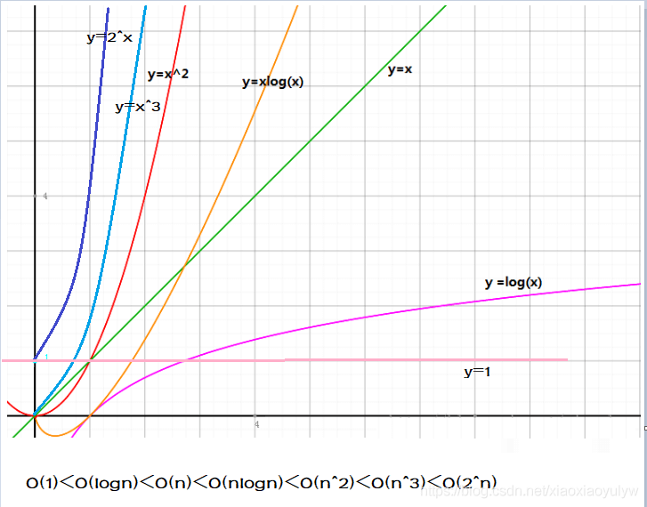

# 时间复杂度

## 参考资料链接

- [算法的时间复杂度](https://zhuanlan.zhihu.com/p/50479555)
- [时间复杂度分析](https://zhuanlan.zhihu.com/p/361636579)
- [看动画轻松理解时间复杂度](https://www.cxyxiaowu.com/1996.html)

## 定义

算法的渐进时间复杂度，大O表示法：T(n) = O(f(n))。

  - 静态分析方法，事前分析，不依赖实际的机器运行（与机器无关，与语言无关）
  - 与数据规模n有关，是<i className="n b bg-1">一种变化趋势，而不是具体的时间</i>（可简单理解为规律）

## 复杂度计算规则

- 四则运算
  - **加法法则：** 如果算法的代码是**平行增加**的，那么就需要加上相应的时间复杂度
  - **乘法法则：** 如果算法的代码增加的是**循环内的嵌套**或者函数的嵌套，那么就需要乘上相应的时间复杂度。
  - **减法法则：** 如果是**去掉算法中平行的代码**，就需要减掉相应的时间复杂度。
  - **除法法则：** 如果是**去掉嵌套内的循环或函数**，就需要除去相应的时间复杂度。

- 简化与忽略
  - 加法常数项可以忽略
  - 最高阶项除外，其它次项可以忽略
  - 与最高次项相乘的常数可以忽略

## 常见复杂度举例

### 常数阶O(1)

- 没有循环等复杂结构
- 与代码行数无关
- 不与 某一数据 规模有关
- 用常数1取代运行时间中的所有加法常数

```jsx title="/src/components/HelloCodeTitle.js"
  int i = 1; // 执行一次
  int j = 2; // 执行一次
  int m = i + j; // 执行一次
```

### 对数阶O(logN)

- 执行次数为 x = log2(N) => 2^x = N
- 对于底数a进行忽略，简写为log ，表示为对数阶

```js
int i = 1; // 执行一次
while(i<n) {
  i = i * 2; // 执行logn次
}
```

### 线性阶O(n)

- 数据规模为n,执行次数也为n
- O(m+n)，可简化为O(n)

```js
for(i=1; i<=n; ++i) {
  j = i; // 执行n次
}
```

### 线性对数阶O(nlogN)

- 将O(n)算法，嵌套O(logN)

```js
for(m=1; m<n; m++){  // 执行n次
    i = 1;  // 执行n次
    while(i<n) {  // 执行 nlogn 次
      i = i * 2; // 执行 nlogn 次
    }
}
```

### 平方阶O(n²)

- 将O(n)算法，嵌套O(n)
- 需要注意变形 O(m*n)

```js
for(x=1; i<=n; x++) { // 执行n次
   for(i=1; i<=n; i++) { // 执行n^2次
       j = i;
       j++;
    }
}
```

### 立方阶O(n³), K次方阶O(n^k)

- 将O(n)算法，嵌套多层O(n)

```js
for(x=1; x<=n; x++) { // 执行n次
  for(y=1; y<=n; y++) { // 执行n^2次
    for(z=1; z<=n; z++) {  // 执行n^3次
        print(x,y,z) // 执行n^3次
      }
  }
}
```

### 指数阶 O(2^n)

### 阶乘阶 O(n!)

- 穷尽所有可能性
- 这种一般是暴力遍历所有解空间的图算法。
- O(n!)的算法不称其为算法，它意味着这个问题尚未解决。n稍微大一点，就会耗尽CPU的算力。

## 图示



## 复杂度的各种情况

### 最好情况时间复杂度

在最理想的情况下的时间复杂度

### 最坏情况时间复杂度

在最差的情况下的时间复杂度

### 平均情况时间复杂度

- 又叫加权平均时间复杂度或者期望时间复杂度，需要考虑每种情况出现的概率。
- 通常我们不需要区分最好、最坏、平均情况时间复杂度三种情况。
- 只有当同一块代码在不同情况下的时间复杂度出现量级的差距时，才需要区分。

### 均摊时间复杂度

- 均摊复杂度可以理解为一种特殊的平均时间复杂度
- 看看是否能将较高的时间复杂度那次操作的耗时，平摊到其他那些时间复杂度比较低的操作上。
- 能够应用均摊时间复杂度的场合，一般就等于最好情况时间复杂度。
